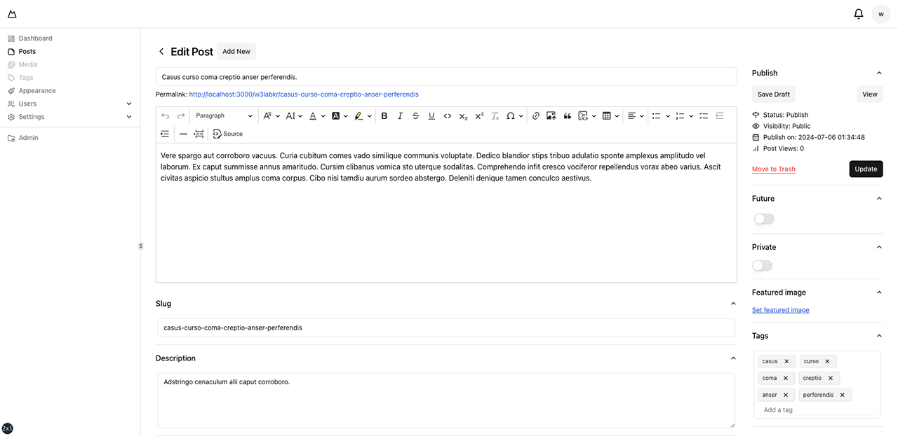

# NextJS with Supabase Auth

This is a starter template for the [NextJS](https://nextjs.org) 14 app router using supabase based on [shadcn-ui](https://ui.shadcn.com).

Denpendency

- NextJS 14 + Typescript + Tailwind
- Shadcn UI (Radix UI) + TimePicker + TagInput
- react-hook-form + zod
- react-i18next + zod-i18n-map
- Redux Toolkit + Redux Persist
- Supabase OAuth with PKCE flow (@supabase/ssr)
- Supabase Email Auth with PKCE flow (@supabase/ssr)
- Supabase Role-based Access Control (RBAC)
- CKEditor 5 + Supabase Upload Adapter
- PWA (Progressive Web Apps)

## Table of Contents

- [NextJS with Supabase Auth](#nextjs-with-supabase-auth)
  - [Table of Contents](#table-of-contents)
  - [Screenshots](#screenshots)
  - [Folder and file Structure](#folder-and-file-structure)
  - [Seed](#seed)
  - [Installation](#installation)
    - [Tailwind CSS](#tailwind-css)
    - [Shadcn UI](#shadcn-ui)
    - [Shadcn UI - Time Picker](#shadcn-ui---time-picker)
    - [Shadcn UI - Emblor](#shadcn-ui---emblor)
    - [Internationalization (i18n)](#internationalization-i18n)
    - [Schema Validation](#schema-validation)
    - [Redux Toolkit](#redux-toolkit)
    - [Supabase Cloud Functions](#supabase-cloud-functions)
    - [Supabase CLI](#supabase-cli)
    - [Supabase Auth](#supabase-auth)
    - [Firebase Auth](#firebase-auth)
    - [Text Editor](#text-editor)
    - [PWA (Progressive Web Apps)](#pwa-progressive-web-apps)
    - [Utils](#utils)
    - [ESLint](#eslint)
  - [Configuration](#configuration)
  - [Usage](#usage)
    - [Data Fetching With JSON](#data-fetching-with-json)
    - [Data Fetching With FormData](#data-fetching-with-formdata)
    - [Error Handling](#error-handling)
  - [Regular Expression](#regular-expression)
  - [Deploying](#deploying)
  - [Troubleshooting](#troubleshooting)
  - [Reference](#reference)

## Screenshots



## Folder and file Structure

The folder and file structure is based on nextjs app router [next.js project structure](https://nextjs.org/docs/getting-started/project-structure).

```txt
.
├── app/                        # App Router
│   └── api/
│       ├── auth/               # Public API for authentication
│       └── v1/                 # APIs that require authentication
├── components/                 # React components
├── config/                     # Configuration for site
├── context/
│   └── app-provider.ts         # Register context provider
├── hooks/
├── lib/                        # Utility functions
├── public/                     # Static assets to be served
│   └── [locales]/              # Internationalization
├── queries/                    # SWR for API
├── screenshots/                # Screenshots
├── store/                      # Redux reducers
├── supabase/                   # Supabase CLI
├── types/
├── components.json             # Shadcn UI
├── i18next.config.ts           # Internationalization
└── package.json                # Project dependencies and scripts
```

## Seed

Search and replace the following text in `/supabase/seed.sql`:

- `my_bucket_id`
- `username@example.com`

Then run the sql.

## Installation

Prompts:

- Would you like to use TypeScript? `Yes`
- Would you like to use ESLint? `Yes`
- Would you like to use Tailwind CSS? `Yes`
- Would you like to use `src/` directory? `No`
- Would you like to use App Router? (recommended) `Yes`
- Would you like to customize the default import alias (@/*)? `No`
- What import alias would you like configured? `@/*`

```shell
npx create-next-app@latest . --typescript
```

React Hooks for Data Fetching

```shell
npm install swr
```

Set the current Node.js version.

```shell
node -v > .nvmrc
```

(Optional) Generating Types if supabase cli is installed.

```shell
npm run gen-types
```

(Optional) Generate manifest and splash screen

```shell
vim public/manifest.json
```

- [PWA Manifest Generator](https://www.simicart.com/manifest-generator.html)
- [Custom Splash Screen on iOS](https://appsco.pe/developer/splash-screens)

Start the development server.

```shell
npm run dev
```

### Tailwind CSS

Install Tailwind CSS

```shell
npm install --save-dev tailwindcss postcss autoprefixer
npx tailwindcss init -p
```

Using 'clsx' or 'classnames' with 'tailwind-merge'

```shell
npm install tailwindcss-animate class-variance-authority clsx tailwind-merge
```

Tailwindcss plugin for hide scrollbar

```shell
npm install tailwind-scrollbar-hide
```

`utils/cn.ts`:

```typescript
import clsx, { ClassValue } from 'clsx';
import { twMerge } from 'tailwind-merge';
export const cn = (...classes: ClassValue[]) => twMerge(clsx(...classes));
```

### Shadcn UI

Beautifully designed components that you can copy and paste into your apps. Accessible.

```shell
npx shadcn-ui@latest init
```

Add icon libraries

```shell
npm install lucide-react @radix-ui/react-icons
```

Dynamically load the lucide icon component.

```javascript
module.exports = {
  transpilePackages: ['lucide-react'],
}
```

Adding dark mode

```shell
npm install next-themes
```

Use the add command to add components and dependencies to your project.

```shell
npx shadcn-ui@latest add
npx shadcn-ui@latest add [component]
```

The configuration for Shadcn UI is `components.json`.

### Shadcn UI - Time Picker

A simple TimePicker for your Shadcn UI project.

- <https://github.com/openstatusHQ/time-picker>

### Shadcn UI - Emblor

A fully-featured tag input component built with shadcn/ui

```shell
npm install emblor
```

- <https://github.com/JaleelB/emblor>

### Internationalization (i18n)

Internationalization for react done right. Using the i18next i18n ecosystem.

```shell
npm install react-i18next i18next i18next-http-backend
```

Useful for translating zod error messages.

```shell
npm install zod-i18n-map
```

[Trans component](https://react.i18next.com/latest/trans-component) rendering for the client side

```javascript
import { useTrans } from '@/hooks/i18next'

const { trans } = useTrans()

export function App() {
  return (
    <div>
    {trans('key', { 
      components: {
        i: <i />,
        link1: <Link href="#" />,
      },
      values: {
        what: 'world'
      }
    })}
    </div>
  )
}

// translation.json
// { "key": "hello <i>beautiful</i> <link1>{{what}}</link1>" }
```

The configuration for i18next is `i18next.config.ts`.

### Schema Validation

React Hooks for form state management and validation (Web + React Native).

```shell
npm install react-hook-form 
npm install zod @hookform/resolvers
```

### Redux Toolkit

The official, opinionated, batteries-included toolset for efficient Redux development.

```shell
npm install @reduxjs/toolkit react-redux
```

persist and rehydrate a redux store

```shell
npm install redux-persist
```

### Supabase Cloud Functions

Run the SQL code in `SQL Editor > New Query`.

Generating Types

- `Api Docs` > `Introduction` > `Generating Types`

### Supabase CLI

Supabase CLI. Manage postgres migrations, run Supabase locally, deploy edge functions. Postgres backups. Generating types from your database schema.

```shell
npm install supabase --save-dev
```

Login with your Personal Access Token:

```shell
npx supabase login
```

Generate types without init

```shell
npx supabase gen types typescript --project-id "YOUR_PROJECT_ID" --schema public > types/supabase.ts
```

Generate types with init

```shell
npx supabase init
npx supabase link --project-ref YOUR_PROJECT_ID
npx supabase gen types typescript --linked > types/supabase.ts
```

`package.json`

```json
{
  "scripts": {
    "gen-types": "supabase gen types --lang=typescript --linked > types/supabase.ts"
  }
}
```

```shell
npm run gen-types
```

[Generating types using Supabase CLI](https://supabase.com/docs/guides/api/rest/generating-types)

### Supabase Auth

Install Supabase packages

```shell
npm install @supabase/supabase-js @supabase/ssr
```

Set environment variables. Edit `.env.local`:

```txt
NEXT_PUBLIC_SUPABASE_URL=<your_supabase_project_url>
NEXT_PUBLIC_SUPABASE_ANON_KEY=<your_supabase_anon_key>
```

- [Setting up Server-Side Auth for Next.js](https://supabase.com/docs/guides/auth/server-side/nextjs)
- [Auth rate limits](https://supabase.com/docs/guides/platform/going-into-prod#auth-rate-limits)

### Firebase Auth

Firebase provides the tools and infrastructure you need to develop, grow, and earn money from your app.

```shell
# npm ERR! Could not resolve dependency:
# npm ERR! peer firebase-admin@"^11.0.1" from firebase-frameworks@0.11.1
npm install -g firebase-tools
npm install firebase firebase-admin@11.11.1
```

Prompts:

- Realtime Database: Configure a security rules file for Realtime Database and (optionally) provision default instance `No`
- Firestore: Configure security rules and indexes files for Firestore `Yes`
- Functions: Configure a Cloud Functions directory and its files `No`
- Hosting: Configure files for Firebase Hosting and (optionally) Set up GitHub Action deploys `No`
- Hosting: Set up GitHub Action deploys `No`
- Storage: Configure a security rules file for Cloud Storage `Yes`
- Emulators: Set up local emulators for Firebase products `Yes`
- Remote Config: Configure a template file for Remote Config `No`
- Extensions: Set up an empty Extensions manifest `No`
- Frameworks: Get started with Frameworks projects. `No`

```shell
firebase init
```

Create a new project alias.

```shell
firebase list
firebase use --add
```

Initialize the Firebase emulator.

```shell
# hosting: Port 5000 is not open on localhost (127.0.0.1,::1), could not start Hosting Emulator
# Port 5000 and 7000 are taken by airplay on MacOS Monterey.
firebase init emulators
```

For Mac/Linux, use the Terminal/Shell to find the Process ID (PID), then kill the process.

```shell
# Error: Could not start Hosting Emulator, port taken.
lsof -ti tcp:5000 | xargs kill -9 && firebase emulators:start
```

Start the firebase emulator.

```shell
firebase emulators:start
```

Set the expiration of a preview channel.

```shell
firebase init hosting
firebase hosting:channel:deploy preview --expires 1h
```

Start firebase deployment.

```shell
firebase deploy
```

### Text Editor

Powerful rich text editor framework with a modular architecture, modern integrations, and features like collaborative editing.

Download the files from [Online Builder](https://ckeditor.com/ckeditor-5/online-builder/) and unzip them into the ckeditor5 folder. However, exclude the [Watchdog](https://ckeditor.com/docs/ckeditor5/latest/installation/integrations/react.html#using-the-ckeditor-5-online-builder) feature.

And run the script below:

```shell
npm install file:./ckeditor5
npm install @ckeditor/ckeditor5-react
```

- [Integrate CKEditor 5 with Next.js](https://ckeditor.com/docs/ckeditor5/latest/installation/integrations/next-js.html)

### PWA (Progressive Web Apps)

Zero config PWA plugin for Next.js, with workbox

```shell
npm install next-pwa
```

- [next-pwa](https://github.com/shadowwalker/next-pwa)

### Utils

Share target browsers between different front-end tools, like Autoprefixer, Stylelint and babel-preset-env

```shell
npm install browserslist
```

A collection of essential TypeScript types

```shell
npm install type-fest
```

Svg react icons of popular icon packs

```shell
npm install react-icons
```

A modern JavaScript utility library delivering modularity, performance, & extras.

```shell
npm install lodash @types/lodash
```

Day.js 2kB immutable date-time library alternative to Moment.js with the same modern API

```shell
npm install dayjs
```

Send e-mails with Node.JS

```shell
npm install nodemailer
npm install --save-dev @types/nodemailer
```

JsonWebToken implementation for node.js

```shell
npm install jsonwebtoken @types/jsonwebtoken
```

Slugifies a string

```shell
npm install slugify
```

Generate massive amounts of fake data in the browser and node.js

```shell
npm install @faker-js/faker
```

Vector (*.svg) country flag icons in 3:2 aspect ratio.

```shell
npm install country-flag-icons
```

A small, fast and rich-API browser/platform/engine detector for both browser and node.

```shell
npm install bowser
```

Flatten/unflatten nested Javascript objects

```shell
npm install flat
```

### ESLint

ESLint is a tool for identifying and reporting on patterns found in ECMAScript/JavaScript code.

```shell
npm install --save-dev eslint eslint-plugin-react eslint-plugin-react-hooks
npm install --save-dev @next/eslint-plugin-next
npm install --save-dev eslint-plugin-import eslint-import-resolver-typescript
npm install --save-dev @typescript-eslint/parser @typescript-eslint/eslint-plugin 
npm install --save-dev prettier eslint-plugin-prettier eslint-config-prettier
npm install --save-dev eslint-plugin-tailwindcss prettier-plugin-tailwindcss
```

Edit `next.config.js`:

```javascript
module.exports = {
  eslint: {
    // Warning: This allows production builds to successfully complete even if
    // your project has ESLint errors.
    ignoreDuringBuilds: true,
  },
}
```

Find and fix problems in your JavaScript code.

```shell
npx eslint ./app
npx eslint --fix ./{app,components,context,hooks,lib,types,utils}
```

To format a file in-place

```shell
npx prettier --check "./app/**/*.{ts,tsx}"
npx prettier --write "./{app,components,context,hooks,lib,types,utils}/**/*.{ts,tsx}"
```

## Configuration

Generating Database Types

`Api Docs > Introduction > Generating Types`

- [generating-types](https://supabase.com/docs/guides/api/rest/generating-types)

Edit `next.config.js`:

```javascript
module.exports = {
  reactStrictMode: true,
  swcMinify: true,
}
```

Edit `packages.json`:

```json
{
    "scripts": {
        "clean:dir": "rm -rf node_modules",
        "clean:cache": "npm cache clean --force",
        "clean": "npm run clean:dir && npm run clean:cache",
        "reinstall": "npm run clean && npm install"
    },
}
```

To enable Turbopack. Edit `packages.json`:

```json
{
    "scripts": {
        "dev": "next dev --turbo"
    }
}
```

After cleaning the directories and cache, install the dependency packages.

```shell
npm run --force reinstall
```

## Usage

Register your provider in `context/app-provider.tsx`.

```javascript
import { Provider } from '@/context/provider'

const providers = [Provider]
```

Register your redux store in `store/root-reducer.ts`.

```javascript
import reducer from './features/slice'

const rootReducer = combineReducers({
  name: reducer,
})
```

### Data Fetching With JSON

Client side

```javascript
import { fetcher } from '@/lib/utils'

const onSubmit = async (formValues: FormValues) => {
  const { data, error } = await fetcher<FetchData>('https://...', {
    method: 'POST',
    body: JSON.stringify(formValues),
  })
}
```

Server side: `route.ts`

```javascript
import { NextResponse, type NextRequest } from 'next/server'

export async function POST(request: NextRequest) {
  const body = await request.json()
  return NextResponse.json({ body })
}
```

### Data Fetching With FormData

Client side

```javascript
import { fetcher } from '@/lib/utils'

const onSubmit = async (formValues: FormValues) => {
  const formData = new FormData()
  formData.append('email', formValues?.email)
  const { data, error } = await fetcher<FetchData>('https://...', {
    method: 'POST',
    body: formData,
  })
}
```

Server side: `route.ts`

```javascript
import { NextResponse, type NextRequest } from 'next/server'

export async function POST(request: NextRequest) {
  const formData = await request.formData()
  const email = formData.get('email') as string
  return NextResponse.json({ email })
}
```

### Error Handling

```javascript
import { Button } from '@/components/ui/button'

export function Component() {
  const [isSubmitting, setIsSubmitting] = React.useState<boolean>(false)
  
  const onSubmit = async (formValues: FormValues) => {
    setIsSubmitting(true)
    try {
      const { data, error } = await fetch('https://...').then((res) => res.json())
      if (error) throw new Error(error?.message)
      // ...
    } catch (e: unknown) {
      console.error((e as Error)?.message)
    } finally {
      setIsSubmitting(false)
    }
  }
  
  return <Button disabled={isSubmitting}>Submit</Button>
}
```

## Regular Expression

CJK (Chinese - Japanese - Korean)

```javascript
/[一-龥ぁ-ゔァ-ヴー々〆〤ㄱ-ㅎㅏ-ㅣ가-힇]+/g
```

cn (Chinese)

```javascript
/[一-龥]+/g
```

jp (Japanese)

```javascript
/[ぁ-ゔァ-ヴー々〆〤]+/g
```

ko (Korean)

```javascript
/[ㄱ-ㅎㅏ-ㅣ가-힇]+/g
```

## Deploying

Deploy app to Vercel

```shell
vercel deploy
```

Deploying Static Exports `next.config.js`:

```javascript
module.exports = {
  output: 'export',
  exportTrailingSlash: true,
  assetPrefix: '/out',
}
```

Dependency packages in production for deployment on Vercel hosting.

```shell
npm install @vercel/analytics
```

(Optional) Vercel Speed Insights package

- [Limits and Pricing for Speed Insights](https://vercel.com/docs/speed-insights/limits-and-pricing)

```shell
npm install @vercel/speed-insights
```

(Optional) Image Optimization

- [Limits and Pricing for Image Optimization](https://vercel.com/docs/image-optimization/limits-and-pricing)

Usage image component

```javascript
import Image from 'next/image'

export default function Page() {
  return <Image />
}
```

Set image element rules in `.eslintrc.js`:

```javascript
module.exports = {
  rules: {
    '@next/next/no-img-element': 'warn',
  }
}
```

## Troubleshooting

...

## Reference

- [shadcn-ui/ui](https://github.com/shadcn-ui/ui)
- [shadcn-ui/taxonomy](https://github.com/shadcn-ui/taxonomy)
- [nextjs-slack-clone](https://github.com/supabase/supabase/tree/master/examples/slack-clone/nextjs-slack-clone)
- [nextjs-subscription-payments](https://github.com/vercel/nextjs-subscription-payments)
